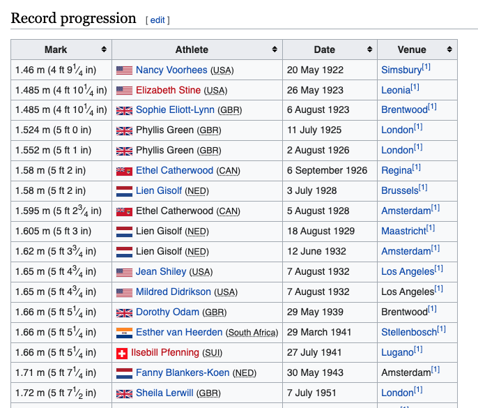

# Detector Inspector Engineering Challenge

Thank you for taking the time to complete this challenge. It helps us understand your experience and the way you approach and solve problems.

## Task

* Write a program in any language you prefer using any frameworks you feel are appropriate
* The input is a URL and the output is an image file
* The input should be a Wikipedia page such as [https://en.wikipedia.org/wiki/Women%27s_high_jump_world_record_progression](https://en.wikipedia.org/wiki/Women%27s_high_jump_world_record_progression)
* Your program should scan the page for a table
* Inside the table the program should identify a numeric column
* The program should then plot a graph of the values in the numeric column
* The graph should be saved as an image file which is the output

A sample table from Wikipedia is shown below.

## Recommendations

Keep your solution simple as you should spend no more than 3 hours working on it. We know your time is valuable.

Please document any assumptions you have made for your solution. We would also like to see information about your solution and how you designed it.

Assume that we don't know anything about the technology you have used - please provide instructions on how to run and test your program. Please don't make us guess!

If you're worried about the time, it's best to focus on demonstrating your plan on how you were going to solve the problem.

## What We Value

A few of the areas we are paying attention to are:

* Holistic approach to the problem
* Evidence of [TDD](https://www.agilealliance.org/glossary/tdd/) and [BDD](https://dannorth.net/introducing-bdd/)
* Using good software engineering practices
* Valuable comments
